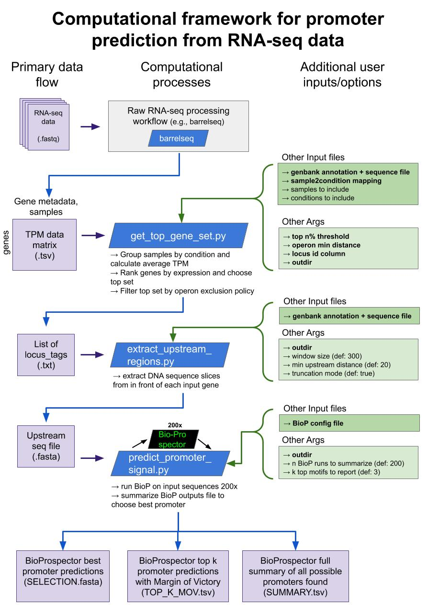

# promoter-id-from-rnaseq
A computational framework to identify promoter sequences from RNA-seq datasets

## Overview
This framework contains 3 main steps:
1. Identify a set of top genes from RNA-seq data
1. Extract sequence regions upstream of a set of genes
1. Search upstream regions for promoter motif structures and make predictions

And 3 main outputs:
1. A fasta file of the exact -35::-10 of the best promoter prediction for each locus
1. A tab-delimited file summarizing the top 3 best promoters for each locus, with Margin of Victories scores to indicate the robustness of each selections (small margin of victory indicates that there were several close predictions worth reviewing)
1. A tab-delimitied file summarzing all possible promoter predictions for each locus

## Workflow Instructions

### Obtain RNA-seq data matrix
Obtain a data matrix where each row is a genome locus, each column is an RNA-seq sample, and each value is the RNA-seq read count in transcripts per million (TPM). The choice of workflow that transforms raw RNA-seq data (fastq) to such a matrix is flexible. Here we used barrelseq (code available here).

### Select a set of top genes
Once data is properly formatted as a matrix of genes by experimental samples, we can use these data to select a set of highly expressed genes that remain high across conditions.

Inputs:
1. TPM data matrix
1. locus_id column
    * The name of the column in the data matrix file where the unique locus ids are specified
1. top n% threshold
    * pick a threshold for the top set and only loci that are in the top `n%` of genes in all experimental conditions will be selected
1. operon minimum distance
    * many prokaryotic loci exist in operons that share promoters. For example, if genes A, B and C are in an operon and all in the highly expressed set, we only really care to find the promoter signal in front of the first gene in the operon (the "upstream region of the otehr genes will just be the coding sequence of it's operon-mates).
    * If this organism does not yet have a list of operons explicitly annotated, this script does a rough estimation: the minimum distance argument specifies that any locus which appears on the same strand and within `min_distance` of another locus will be flagged as "possibly in an operon" and later excluded from the list of top loci in which to search upstream regions for promoter signals
1. sample2condition mapping file. 
    * The columns of the TPM data matrix should reflect unique sample names (distinct RNA-seq experiments). Some of these samples may be replicates, or just separate experiments that fall under the same experimental category (e.g., "Low Methane", or "High Copper" etc). The experimental conditions can be called anything, but the sample2condition file is the formal way to specify which sample belongs to which category.

    example format for sample2condition.txt
    | | |
    | ------------ | ------------- |
    | 5GB1_FM12_TR2 | lowCH4 |
    | 5GB1_FM23_TR3 | MeOH |
    | 5GB1_FM40_T0_TR1 | NoCu |
    | 5GB1_FM34_T8_TR1 | HighCu |
  
1. genbank annotation and sequence file
    * the `locus_tag` of the features in this file should exactly match the locus ids in the TPM data matrix. 
1. Output directory
    * Directory where the final list of top loci is store 
1. (Optional) samples to include file (.txt)
    * if your TPM matrix contains extra samples, use this file to specify only the sample names to include. If none is provided, all sample names will be included
1. (Optional) conditions to include file (.txt)
    * if there are entire experimental categories that you wish to exclude but their samples are in the TPM matrix, use this file to specify only the experimental categories to keep for this analysis

### Example run command
`python get_top_gene_set.py data/extract_TPM_counts.tsv locus_tag 3 120 data/sample2condition.txt data/5GB1c_sequence.gb output -c config/conditions_to_include.txt -s config/samples_to_include.txt`
