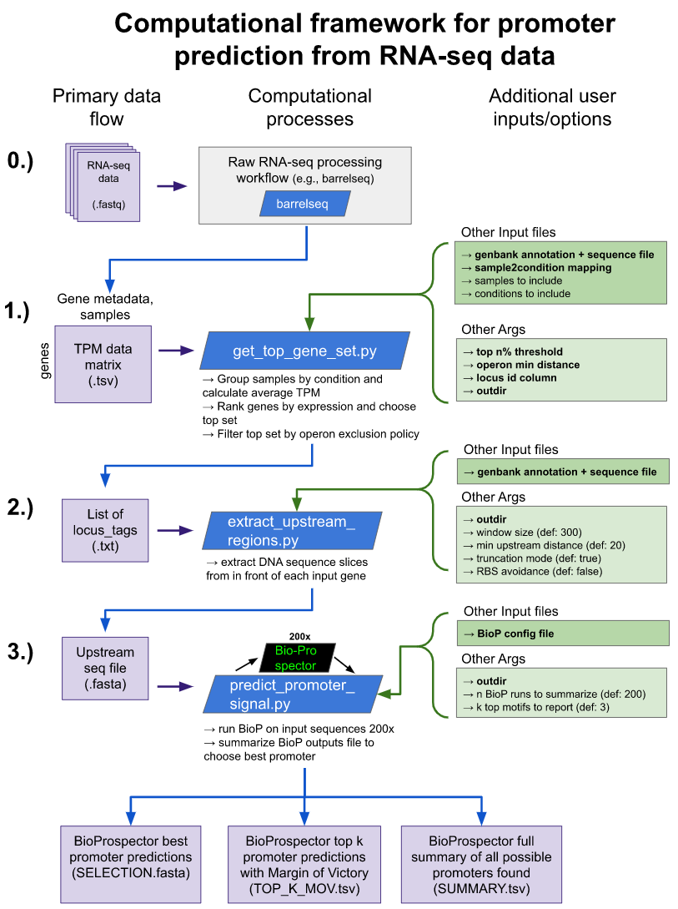

# promoter-id-from-rnaseq
This repository contains a framework, data, and analysis associated with the paper "A computational framework to identify promoter sequences from RNA-seq datasets." There is also a [**project page**](https://erinhwilson.github.io/promoter-id-from-rnaseq/) with data analysis tutorials and an interactive visualization gallery. 

_This publication is currently in preparation. A link to the paper will be provided upon publication._ 

## Tutorial Notebooks
Jupyter notebook tutorials are provided in `/tutorials` to help users better understand various stages of the workflow and explore relevant outputs.
1. [Exploration of TPM data across conditions](https://erinhwilson.github.io/promoter-id-from-rnaseq/tutorials/tpm-data-exploration.html) [`ipynb`](https://github.com/erinhwilson/promoter-id-from-rnaseq/blob/master/tpm-data-exploration.ipynb)
1. [Inspection of BioProspector output files](https://erinhwilson.github.io/promoter-id-from-rnaseq/tutorials/inspect_BioProspector_results.html) [`ipynb`](https://github.com/erinhwilson/promoter-id-from-rnaseq/blob/master/inspect_BioProspector_results.ipynb)
1. [Consensus motif analysis](https://erinhwilson.github.io/promoter-id-from-rnaseq/tutorials/analyze_consensus_motif.html) [`ipynb`](https://github.com/erinhwilson/promoter-id-from-rnaseq/blob/master/analyze_consensus_motif.ipynb)
1. [Operon upstream distance exploration](https://erinhwilson.github.io/promoter-id-from-rnaseq/tutorials/operon_distance_exploration.html) [`ipynb`](https://github.com/erinhwilson/promoter-id-from-rnaseq/blob/master/tutorials/operon_distance_exploration.ipynb)

## Overview
This computational framework contains 3 main steps:
1. Identify a set of strongly expressed loci from RNA-seq data
1. Extract sequence regions upstream of the set of loci from Step 1
1. Search upstream regions for promoter motif structures and make predictions for the -35/-10 sequence

And 3 main outputs:
1. A fasta file of the exact -35 through -10 sequence (hexamer, spacer, hexamer) of the best promoter prediction for each locus
1. A tab-delimited file summarizing the top _k_ best promoters for each locus, with Margin of Victory scores to indicate the robustness of each prediction
1. A tab-delimitied file summarzing all possible promoter predictions for each locus

## Workflow Instructions

### 0.) Obtain RNA-seq data matrix
Obtain a data matrix where each row is a genome locus, each column is an RNA-seq sample, and each value is the RNA-seq read count in transcripts per million (TPM). The choice of workflow that transforms raw RNA-seq data (fastq) to a TPM matrix is flexible. In this work, we used barrelseq (code available [here](https://github.com/BeckResearchLab/barrelseq). An example TPM matrix can be found in `data/extract_TPM_counts.tsv`

### 1.) Select a set of top genes (`get_top_gene_set.py`)
Once data is properly formatted as a matrix of loci by experimental samples, we can use these data to select a set of highly expressed loci that remain high across conditions.

Inputs:
1. TPM data matrix
1. locus_id column
    * The name of the column in the TPM data matrix file where the unique locus ids are specified. (In the example in  `data/extract_TPM_counts.tsv`, the appropriate column is called `locus_tag`.)
1. top `n%` threshold
    * pick a threshold for considering loci to be in the top set: only loci that are in the top `n%` in _all_ experimental conditions will be selected
1. operon minimum distance
    * many prokaryotic loci exist in operons that share promoters. For example, if genes A, B and C are in an operon and all end up in the highly expressed set, we only really care to find the promoter signal in front of the first gene in the operon (the "upstream region" of the other genes will just be the coding sequence of its operon-mates).
    * If this organism does not yet have a list of operons explicitly annotated, this script does a rough estimation: the minimum distance argument specifies that any locus which appears on the same strand and within `min_distance` of another locus will be flagged as "possibly in an operon" and later excluded from the list of top loci in which to search upstream regions for promoter signals. Here it is just flagged with a boolean tag. 
    * Increasing  `min_distance` will lump more genes into possible operons while decreasing `min_dist` will be looser and not ignore as many loci. 
        * A notebook showing some operon analysis and how we chose a default value is available [here](https://github.com/erinhwilson/promoter-id-from-rnaseq/blob/master/tutorials/operon_distance_exploration.ipynb)
1. sample2condition mapping file. 
    * The columns of the TPM data matrix should reflect unique sample names (distinct RNA-seq experiments). Some of these samples may be replicates, or just separate experiments that fall under the same experimental category (e.g., "Low Methane", or "High Copper" etc). The experimental conditions can be called anything, but the sample2condition file is the formal way to specify which sample belongs to which category.

    example format for sample2condition.txt
    | | |
    | ------------ | ------------- |
    | 5GB1_FM12_TR2 | lowCH4 |
    | 5GB1_FM23_TR3 | MeOH |
    | 5GB1_FM40_T0_TR1 | NoCu |
    | 5GB1_FM34_T8_TR1 | HighCu |
  
    * this must be a simple 2-column tab-delimited file (an example can be found at `data/sample2condition.txt`
    
1. genbank annotation and sequence file
    * the `locus_tag` of the features in this file should exactly match the locus ids in the TPM data matrix. 
1. Output directory
    * Directory where the final list of top loci is store 
1. (Optional) samples to include file (.txt)
    * if your TPM matrix contains extra samples, use this file to specify only the sample names to include. If none is provided, all sample names will be included
1. (Optional) conditions to include file (.txt)
    * if there are entire experimental categories that you wish to exclude but their samples are in the TPM matrix, use this file to specify only the experimental categories to keep for this analysis

#### Example run command
`python get_top_gene_set.py data/extract_TPM_counts.tsv locus_tag 3 120 data/sample2condition.txt data/5GB1c_sequence.gb out_dir -c config/conditions_to_include.txt -s config/samples_to_include.txt`

### 2.) Extract upstream sequence regions (`extract_upstream_regions.py`)
With a top set of loci identified in `get_top_gene_set.py`, the next script will go to the genbank file and actually extract the DNA sequence windows upstream of these top loci. By default the script will extract a 300bp window immediately upstream of the feature start coordinate. 

However, this script is conscious of other nearby annotations which may be within 300bp, and by default, will truncate the window extracted so as not to include partial coding sequences of other features. But on the other hand, some sequences are very close together (e.g., two divergently expressed genes' whose start coordinates are within 10 bp), so at a minimum, we will extract 20bp upstream, even if it overlaps with another feature.

Inputs:
1. List of locus ids
    * Output from `get_top_gene_set.py`: two-column tab delimited file. First column is the locus id. Second column is a boolean if the locus is "possibly in an operon" as determined by the `min_dist` parameter in the `get_top_gene_set.py` script.
1. genbank annotation and sequence file
1. output directory
    * directory where fasta file of upstream regions of each of the top loci will be stored. _Note: loci flagged as "possibly in an operon" will be excluded from this fasta file (as specified by column 2 of the "list of locus ids" input file._
1. (Optional) window size (default: 300bp)
    * size of the upstream window to extract 
1. (Optional) min upstream distance (default: 20bp)
    * sometimes genes are too close (or even overlapping). By default this program will truncate upstream sequences to avoid including coding sequence DNA of other features, but if this parameters sets the minimum sequence that must be extracted, even if there is some overlap
1. (Optional) no truncation mode
    * by default, this program will truncate upstream regions to avoid coding sequences of nearby features. However this mode can be turned off with `--no_trunc` and exactly `window size` bases will be extracted from every locus with no attempt to truncate
    
#### Example run command
`python extract_upstream_regions.py out_dir/loci_in_top_3perc.txt data/5GB1c_sequence.gb out_dir`

### 3.) Search upstream regions for patterns to make promoter predictions (`predict_promoter_signal.py`)
With the upstream regions for a set of highly expressed loci in hand, we are next interested in searching these sequences for a common pattern. Specifically, we are looking for sigma-70 like promoter patterns which influence strong transcription initiation in this top set of loci. Here, we use a motif finding tool called BioProspector which can accept as input a particular motif structure (e.g., a hexamer, followed by 15-18 bp of spacer, followed by another hexamer) and search sequences for that structure. Without sepcific instructions for what precise sequence to find, BioProspector will simply use that structure to search for common patterns across all the upstream regions and make a prediction for what a consensus motif may be. (More details about BioProspector can be found [here](https://psb.stanford.edu/psb-online/proceedings/psb01/liu.pdf)). 

1 run of BioProspector will yield 5 consensus motif predictions and report the *location* in each input sequence for where that consensus motif was found. Since BioProspector's search algorithm involves some randomness, we run it `n` times and parse the 5 consensus motif predictions out of all `n` runs. The locations of sequence matches from all of these 5 x `n` predictions are used as  "votes": how many times was each match location (aka, specific subsequence at a specific upstream region coordinate) identified by any of the consensus motif predictions? The more votes a match location gets, the more likely we assume it is to actually be the true promoter for this locus (because BioProspector found it so frequently). 

Sometimes the voting is very clear: 1 location for a given locus' upstream sequence recieves far and away the majority of the votes (high margin of victory). But sometimes it is less clear: there may be two or more sequences which receive a very similar amount of votes (small margin of victory), and thus there is more uncertainty surrounding which sequence is most likely to be the -35,-10 promoter. 

To summarize the above: we run BioProspector `n` times (default: 200) and use it's predictions as votes for particular motifs identified in each locus. To fully communicate the results of this prediction script, we provide 3 outputs.
1. `SELECTION.fa`
    * A fasta file of the top voted promoter sequence for each locus. The sequence starts exactly at the -35 hexamer, spans a variable spacer, and ends exactly at the end of the -10 hexamer. Thus, the first 6 and last 6 bases of the sequence are the sequences that match the consensus motif blocks identified by BioProspector.
1. `TOP_K_MOV.tsv`
    * The difference between a given match location and the next most-voted-for location is called the Margin of Victory. While SELECTION.fa only shows the absolute top voted sequence, some of these votes may be close calls. This file provides more detailed information about the top `k` match locations with most votes and the margin of victory by which they won. A researcher may wish to inspect the promoter calls with "low margin of victory" as there may be another equally likely promoter sequence than the one provided in the `SELECTION.fa`
1. `SUMMARY.tsv`
    * A full summary of all the votes recorded across the `n` BioProspector runs. A researcher may wish to consult this if they want more details about vote patterns than just the top `k`.

Inputs:
1. BioProspector config file
    * configuration of the BioProspector input arguments. An example config file can be found in `config/bioprospector_config.txt`
1. output directory
    * directory where the 3 output files (SELECTION.fa, TOP_K_MOV.tsv, and SUMMARY.tsv) will be stored
1. `n` (def: 200)
    * Number of BioProspector iterations to run
1. `k` (def: 3)
    * Number of top motifs to report in the TOP_K_MOV.tsv file
    
#### Example run command
`python predict_promoter_signal.py out_dir/loci_in_top_3perc_upstream_regions_w300_min20_trunc.fa config/bioprospector_config.txt biop_out_dir -n 500 -k 5`

## Validation
Computational validation of the BioProspector outputs is carried out in the [Consensus Motif Analysis](https://github.com/erinhwilson/promoter-id-from-rnaseq/blob/master/analyze_consensus_motif.ipynb) Jupyter Notebook tutorial, which relies on functions from `consensus_viz_utils.py`.
