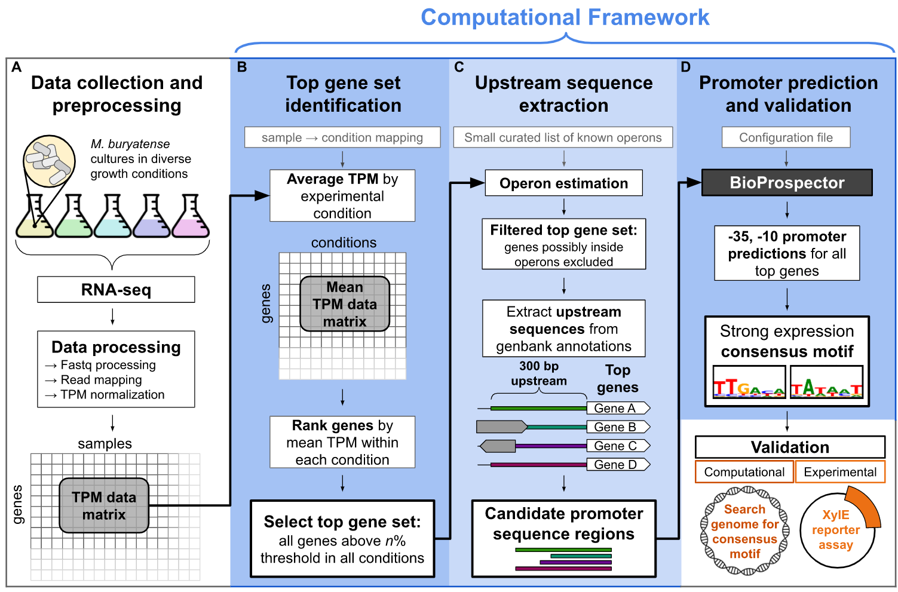

# Welcome!
Here you will find further details and resources for exploring data and analysis related to the paper **"A computational framework for identifying promoter sequences in non-model organisms using RNA-seq datasets"** (paper currently under review). The [git repo](https://github.com/erinhwilson/promoter-id-from-rnaseq/) contains all instructions for running the code but below you will find static html tutorials as well as links to their corresponding Jupyter Notebooks. We've also provided a data visualization gallery of interactive plots that we hope will facilitate further exploration and understanding of _M. buryatense_ expression data.

## Tutorials
See the following Jupyter Notebooks for tutorials on how various pieces of analysis were carried out:
1. [Exploration of TPM data across conditions](tutorials/tpm-data-exploration.html) [`ipynb`](https://github.com/erinhwilson/promoter-id-from-rnaseq/blob/master/tutorials/tpm-data-exploration.ipynb)
1. [Inspection of BioProspector output files](tutorials/inspect_BioProspector_results.html) [`ipynb`](https://github.com/erinhwilson/promoter-id-from-rnaseq/blob/master/tutorials/inspect_BioProspector_results.ipynb)
1. [Consensus motif analysis](tutorials/analyze_consensus_motif.html) [`ipynb`](https://github.com/erinhwilson/promoter-id-from-rnaseq/blob/master/tutorials/analyze_consensus_motif.ipynb)
1. [Compare consensus predictions across organisms](tutorials/compare_consensus_predictions.html) [`ipynb`](https://github.com/erinhwilson/promoter-id-from-rnaseq/blob/master/tutorials/compare_consensus_predictions.ipynb)
1. [Operon distance exploration](tutorials/operon_distance_exploration.html) [`ipynb`](https://github.com/erinhwilson/promoter-id-from-rnaseq/blob/master/tutorials/operon_distance_exploration.ipynb)

## Interactive Visualizations

Choose an image in the gallery to explore explore data interactively.

  <!-- <a href="viz/tradeoff.html" title="Go to interactive visualization">
    <figure style="text-align:center">
    
    <figcaption >Top Gene Set Tradeoff</figcaption>
    </figure>
  </a> -->
    <table>
        <tr>
            <td>
                <a href="viz/tradeoff.html" title="Go to interactive visualization" display='inline'>
                    
                    
Top Gene Set Tradeoff

                </a>
            </td>
            <td>
                <a href="viz/multi_top1perc.html" title="Go to interactive visualization" display='inline'>
                    
                    
Top 1% Expression

                </a>
            </td>
            <td>
                <a href="viz/multi_top3perc.html" title="Go to interactive visualization" display='inline'>
                    
                    
Top 3% Expression

                </a>
            </td>
        </tr>
        <tr>
             <td>
                <a href="viz/mbur_operon_dist.html" title="Go to interactive visualization" display='inline'>
                    
                    
Intra-operon upstream distances

                </a>
            </td>
            <td>
                <a href="viz/figureS4C.html" title="Go to interactive visualization" display='inline'>
                    
                    
Promoter Enrichment vs Information Content

                </a>
            </td>
        </tr>
    </table>

